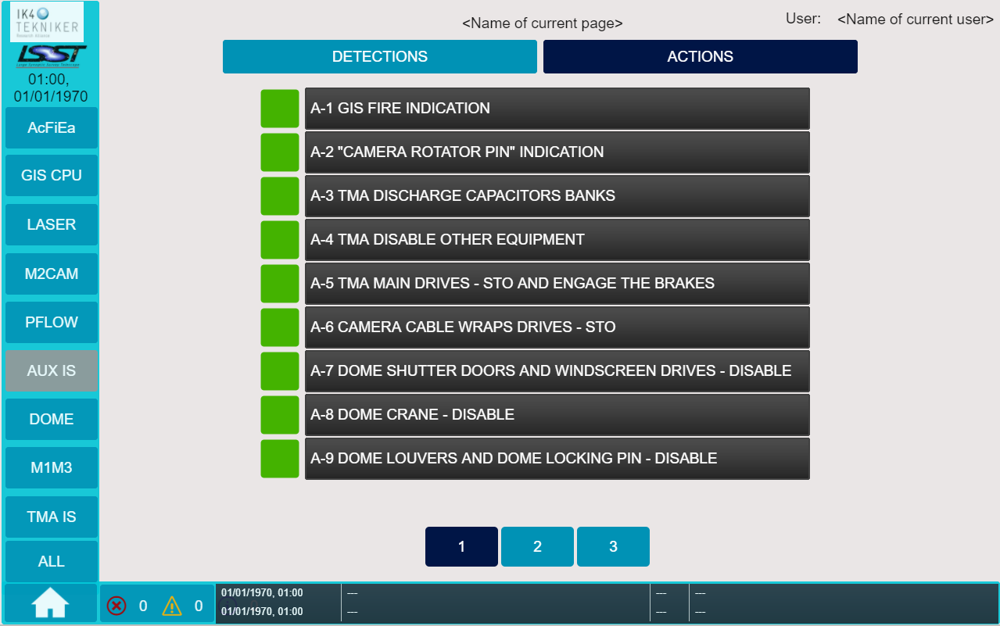
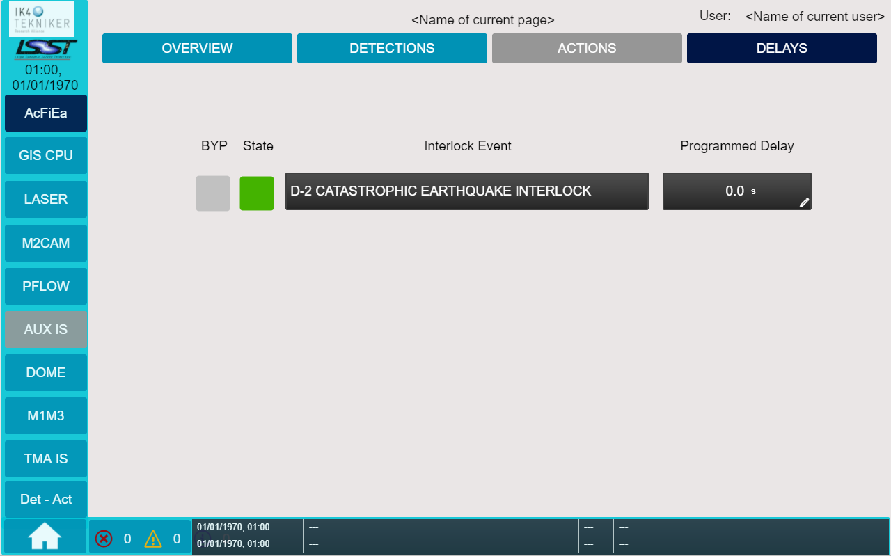

# User Interface Manual

|                             |                           |
|-----------------------------|---------------------------|
| **Requested by:**           | **LSST**                  |
| **Doc. Code / Version nº:** | 7186_GIS_0005 / 2.0       |
| **Editor:**                 | A. Martin/F. Javier López |
| **Approved by:**            | F. Javier López           |
| **Date:**                   | 2022/08/30                |

## DOCUMENT HISTORY

<table>
<colgroup>
<col style="width: 11%" />
<col style="width: 16%" />
<col style="width: 20%" />
<col style="width: 51%" />
</colgroup>
<tbody>
<tr class="odd">
<td><strong>Version</strong></td>
<td><strong>Date</strong></td>
<td><strong>Author</strong></td>
<td><strong>Comments</strong></td>
</tr>
<tr class="even">
<td><strong>1.0</strong></td>
<td>2019/06/03</td>
<td><ol type="A">
<li>
Martín
</li>
</ol></td>
<td><blockquote>

<em>Initial Version</em>

</blockquote></td>
</tr>
<tr class="odd">
<td><strong>2.0</strong></td>
<td>2022/08/30</td>
<td><blockquote>

F. Javier López

</blockquote></td>
<td><blockquote>

<em>After review by Empresarios Agrupados</em>

</blockquote></td>
</tr>
<tr class="even">
<td></td>
<td></td>
<td></td>
<td></td>
</tr>
<tr class="odd">
<td></td>
<td></td>
<td></td>
<td></td>
</tr>
<tr class="even">
<td></td>
<td></td>
<td></td>
<td></td>
</tr>
</tbody>
</table>

<table>
<colgroup>
<col style="width: 15%" />
<col style="width: 84%" />
</colgroup>
<thead>
<tr class="header">
<th><strong>Acronyms</strong></th>
<th><strong>Definition</strong></th>
</tr>
<tr class="odd">
<th>
AFE / AcFiEa

ETPB

CPU
</th>
<th>
Access Fire Earthquake

Emergency trip pushbutton

Control Programmable Unit
</th>
</tr>
<tr class="header">
<th>GIS</th>
<th>Global Interlock System</th>
</tr>
<tr class="odd">
<th>HMI</th>
<th>Human Machine Interface</th>
</tr>
<tr class="header">
<th>
IS

LAS
</th>
<th>
Interlock System

LASER
</th>
</tr>
<tr class="odd">
<th>
LSST

UI
</th>
<th>
Large Synoptic Survey Telescope

User Interface
</th>
</tr>
</thead>
<tbody>
</tbody>
</table>

## Introduction

The aim of this document is to describe the operation of the Global Interlock System (GIS), which will be operated by
means of a dedicated user interface. In this document, the key features of the user interface will be listed, indicating
the included commanding and monitoring possibilities.

## Reference documents

|        |                                                                         |                   |             |
|--------|-------------------------------------------------------------------------|-------------------|-------------|
| **Nº** | **Document**                                                            | **Code**          | **Version** |
| **1**  | Updated Hazard Register                                                 | 092-308-F-Z-00002 | 4           |
| **2**  | LSST Summit Safety Interlock System                                     | LTS-99            | 4.1         |
| **3**  | Telescope Mount Assembly to Interlock System Interface Control Document | LTS-173           | 2           |
| **4**  | Dome to Global Interlock System Interface Control Document              | LTS-174           | 2           |
| **5**  | Hexapod and Rotator Interface Control Document                          | LTS-175           | 2           |
| **6**  | M2 Cell Assembly Interlocks                                             | LTS-177           | 2           |
| **7**  | Global Interlock System (GIS) Analysis                                  | 092-308-E-Z-00004 | 4           |

## Previous concepts

The graphical user interface (UI) designed to operate the GIS is programmed using PILZ PASVisu software and downloaded
into a PILZ PMI (Pilz Human Machine Interface) panel. This panel will be connected to the GIS central PSS4000 controller
(from now on CENTRAL CONTROLLER) via an Ethernet connection.

The safety areas of the telescope are defined as shown in document LSST Summit Safety Interlock System (Ref. 2):

-   GIS CPU (*GIS CPU*). Main controller of GIS in control room

-   Access Control System / Fire Main Controller / Earthquake Control System (*AcFiEa*).

-   Laser Controller (*LASER*).

-   M2 area: includes the M2 actuator, the M2 hexapod, the Camera Hexapod and the Camera Rotator (*M2CAM*).

-   Pflow Controller & Auxiliary elements (*PFLOW*).

-   Auxiliary Controller IS (*AUX IS*) from Auxiliary telescope

-   DOME IS (*DOME*).

-   M1M3 Controller (*M1M3*).

-   TMA IS (*TMA IS*).

Each area can contain one or more safety subsystem controllers, which can be of two types:

-   Full size controllers, PSS4000 model, connected via Safetynet P RFTN to the CENTRAL CONTROLLER.

-   Relay based subsystems. This type of safety subsystem is managed by a PILZ relay, and the interface to the CENTRAL
    CONTROLLER is via two failsafe inputs, two potential free outputs, and one rearming output.

Central Controller receives numerous inputs, which can be signals from other subsystems, interlocks signals or other
detections such as power supplies signals and also it sends outputs to the different subsytems and actuators.

In document (Ref: 7) has been designed a table of Detections and Actions, the table defines the input signal that
generate each interlock system and the actuations related with each detection. Table is shown in the following figure.
Those signals are called Detections and Actions and are managed by the Central Controller.

Fig. 1 Detections and Actions table v4.0 (see appendix 1).

## Operator Interface

The graphical user interface (UI) designed to operate the GIS is shown in the following figure.

Fig. 2 General Overview.

As shown in the figure, the main screen of the UI shows a general overview of the safety system of the telescope, in
which the operator can see the general status of each safety area and navigate to see more detailed information of each
area. The safety areas are defined as shown in document LSST Summit Safety Interlock System (Ref. 2):

-   Access Control System / Fire Main Controller / Earthquake Control System (*AcFiEa*).

-   GIS CPU (*GIS CPU*).

-   Laser Controller (*LASER*).

-   M2 area: includes the M2 actuator, the M2 hexapod, the Camera Hexapod and the Camera Rotator (*M2CAM*).

-   Pflow Controller & Auxiliary Elements (*PFLOW*).

-   Auxiliary Telescope Controller IS (*AUX IS*).

-   DOME IS (*DOME*).

-   M1M3 Controller (*M1M3*).

-   TMA IS (*TMA IS*).

Each area can contain one or more safety subsystem controllers, which can be of two types:

-   Full size controllers, PSS4000 model, connected via Safetynet P RFTN to the CENTRAL CONTROLLER. These subsystems are
    the DOME IS, the TMA IS and the Auxiliary Telescope Controller IS.

-   Relay based subsystems. These subsystems' safety is managed by a PILZ relay, and the interface to the CENTRAL
    CONTROLLER is via two failsafe inputs, two potential free outputs, and one rearming output.

In the following sections, the commanding and monitoring possibilities of the designed user interface are described in
detail.

### Navigating to each area

A common navigation bar is located on the left side of the screen (see Fig. 3). The following sections
([4.2]{.underline}, [4.3]{.underline}) describe the functionality of the buttons on the navigation bar.

Fig. 3 Navigation bar.

On the botton side of the screen there is the diagnostic information (see Fig. 4), which is at the same time a
navigation button that opens the diagnostic list and log screens, to see further information go to section
[4.6]{.underline}.

Fig. 4 Diagnostic information bar.

On the top of the screens there is also information about the current page selected, the user logged in and the date and
time (see Fig. 5).

Fig. 5 Information data.

Besides the common navigation and diagnostic bar, in the general overview page (HOME page) on the right side there is a
navigator bar (Fig. 6) to access the following options:

-   User log in/log out: user can start a new session or close the actual session.

-   Administration: user management (user management is detailed in section [4.7]{.underline}).

-   Information: project information like the software project running on the controllers.

Fig. 6 HOME page.

In the general overview screen (HOME), beside each area, a navigation button is implemented to navigate into the desired
area.

Whenever an area is selected (navigation button pressed), the operator will navigate to the screens showing the detailed
safety information of that area. These screens are described in section [4.3]{.underline}.

Also, besides each navigation button there are two indicators: system state indicator and system bypass indicator.

Fig. 7 HOME page navigation button and indicators of each system.

The interpretation of the indicators is the following one (also, visual interpretation is shown in Fig. 8):

-   System bypass indicator:

    -   Grey color: safe condition, no subsystem bypassed.

    -   Orange color with text "BYP": unsafe condition, at least one subsystem has been bypassed.

-   System state indicator:

    -   Green color: safe condition, no error detected.

    -   Red color with text "!": unsafe condition, at least one error detected.

Fig. 8 Visual interpretation of indicators.

Additionally, those two indicators are implemented on the navigation bar, as it can be seen in Fig. 9, to determine the
subsystem status, without having to go to the home screen.

Fig. 9 Indicators on navigation bar.

### Det-Act: Central Controller I/O List

Fig. 10 "ALL" navigation button to access Central Controller I/O List

This button opens a new page, showing the status of all Detections and Actions signals defined in the GIS table (Ref: 7,
appendix).

Fig. 11 Detections.

In the initially presented screen, the status of the Detection inputs is shown by means of a squared box: the green
color means that the Detection is OK and there is not any interlock associated to this Detection, while the red color
with the text "!" indicates that the Detection is in unsafe condition, so the interlock is active.

Besides the state square box, there is another box that indicates if the corresponding Detection is bypassed: the grey
color means that the Detection is not bypassed, while the orange color with the text "BYP" indicates that the Detection
is bypassed.

On the right side of each Detection is placed a navigation button that opens the page of that Detection. For example, if
you click on D-7 navigation button, the following screen appears, with all the actions that depend on this detection,
according to the GIS table (Ref. 7)

Fig. 12 Detection Related Actuations.

On the left side of each Detection is placed a switch button that, if the user has the sufficient permissions,
activates/desactivates the action of bypassing the Detection.

Fig. 13 Detection inputs information and navigation.

Also, numerical navigation buttons are placed in the botton of the screen to allow navigating throught Detections'
pages, where are the rest of the Detection signals.

Fig. 14 Detections navigation's pages.

Navigation buttons allow to change between Detection signals and Action signals.

-   A button named "DETECTIONS", to navigate to the Detection signals coming to the CENTRAL CONTROLLER.

-   A button named "ACTIONS" to show all the Actions managed by the CENTRAL CONTROLLER on the subsystems.

Fig. 15 Detections / Actions navigation.

When the "ACTIONS" button is pressed, a similar screen is displayed to monitor all the Actions managed by the CENTRAL
CONTROLLER.

Fig. 16 Actions.

The status of the Action signals is shown by means of a squared box. The color of the box represents if the Actuation is
not fired (Green color), so the subsystem is not being affected, or if the Actuation has been fired (Red color with text
"!"), and then the subsystem is being affected by the respective actuation.

This screen, as the one with the Detection signals, includes numerical navigation buttons to move between the Actions'
pages.

Fig. 17 Actions navigation's pages.

### Subsystem Controllers

To access each subsystem controller area there are two ways:

-   Through navigation bar (on the left side of the screen).

-   Through HOME page, pressing the corresponding navigation button of the area.

On both options a general view of the states of the safety areas is shown, as it was presented at the end of section
[4.1]{.underline}.

For each area has been defined the following screens:

-   OVERVIEW: Area controllers overview.

-   DETECTIONS: Incoming event status.

-   ACTIONS: Actuations to be done by the CENTRAL CONTROLLER on the subsystem / area.

-   DELAYS: Delay settings of each actuation. Only in Access/Fire/Earthquake area.

These screens are described in the following sections ([4.3.1 OVERVIEW: Area Controllers Overview]{.underline}, [4.3.2
DETECTIONS: Incoming Event Status]{.underline}, [4.3.3 ACTIONS: Actuations on the subsystem]{.underline} and [4.3.4
DELAYS: Delay settings of each actuation]{.underline}).

This is placed a navigation buttons to access each screen, Fig. 18.

Fig. 18 Navigation buttons.

In Fig. 19 appears the navigation buttons of the Access/Fire/Earthquake area. This area is the only one that has delays.
Also, ACTIONS button is in grey color, if a button is in grey color indicates that there is no information related and
there is no link to any page on that button.

Fig. 19 Navigation buttons -- Access/Fire/Earthquake area.

#### OVERVIEW: Area Controllers Overview

A general overview of the operative status of the safety controllers of this area is shown in the screen.

If the controller of the area is a PSS4000 controller, the information shown in the screen is related to the status of
the controller and some diagnostics coming directly from the CPU. An example is shown in Fig. 20.

On the OVERVIEW screen is also shown the power supply information: power supply redundancy and power supply balancing.

Fig. 20 PSS4000 Controller Overview.

If the area controller is based on a safety relay or there are relays related to area that is managed by the Central
Controller, an image of the controller and the status of the detection inputs coming from the controller are shown to
the operator. For this kind of controllers, there is also a rearming button present for each controller. The operator
can use this button to rearm the controller if necessary (See point 4.4.2 Rearming a relay based subsystem). A example
is shown in Fig. 21.

Fig. 21 M2CAM relays overview.

Information is shown besides each one of the relay controller image (see Fig. 22).

-   Relay name: indicates the name of the subsystem relay.

-   State: this icon will be coloured in red if the subsystem relay is in unsafe condition, and in green if it is in
    safe condition, both channels must be OK, in green (fig 20 was obtained from PASVISU and not when the program was
    running, because with the two channels in failure it cannot be in a safe condition).

-   Channel 1 and Channel 2: these two icons indicate the status of each one of the safety inputs coming from the
    subsystem controller to the GIS. In red shows that input is in FALSE state (incorrect state), and in green will show
    that input is in TRUE state (correct state).

-   Reset signal: indicates if the reset output to the subsystem is being activated (colored in green with the text "x"
    if RESET button is pushed) or not (colored in grey with no text if RESET button is not pushed)

Fig. 22 Relay/subsystem diagnostic.

#### DETECTIONS: Incoming Event Status

In this screen, the operator can see the Detection inputs that are coming from the subsystem to the CENTRAL CONTROLLER.
It shows the hardwired or communicated Detections that are being evaluated by the CENTRAL CONTROLLER and their states.
These Detection signals are defined by the GIS Interlock Table of the document 092-308-E-Z-00004.

There are two indicators, state and bypass, one bypass switch button and one navigation button for each Detection. The
information and options are the same as explained in section [4.2 Det-Act: Central Controller I/O List]{.underline}.

Status of the Detection inputs: the green color means that the Detection is OK and there is not any interlock associated
to this Detection, while the red color with the text "!" indicates that the Detection is in unsafe condition, so the
interlock is active.

Besides the state square box, there is another box that indicates if the corresponding Detection is bypassed: the grey
color means that the Detection is not bypassed, while the orange color with the text "BYP" indicates that the Detection
is bypassed.

On the right side of each Detection is placed a navigation button that opens the page of that Detection (fig 23 for
example).

On the left side of each Detection is placed a switch button that, if the user has administrator permissions, can
activates/desactivates the action of bypassing the Detection. See section [4.5 Bypassing]{.underline} .

Fig. 23 Detection inputs information and navigation.

In the next figure, as an example, the Detections coming from the TMA IS are shown.

Fig. 24 Detections from TMA IS.

The Detections associated with TMA IS can be seen in the following figure. The source is the GIS interlock table (Ref:
7).

Fig. 25 Detections coming from TMA IS.

If the operator selects one of the Detection inputs, with the Navigations button to Detections page of each subsystem,
all the actuations related to that input will be shown, independently of which subsystem is affected. These actuations
are according to the GIS Interlock Table of the document 092-308-E-Z-00004.

Fig. 26 Detection Related Actuations.

With the "return" button, the operator can return to the previous screen, where all the Detections related to the area
to which the action belong are shown.

#### ACTIONS: Actuations on the subsystem

In this screen, the actuations of the CENTRAL CONTROLLER on each subsystem are shown. These are those defined in the GIS
Interlock Table of the document 092-308-E-Z-00004.

The status of each one is shown by a square box. The color of the box represents if the Actuation is not fired (green
color), so the subsystem is not being affected, or if the Actuation has been fired (red color), and then the subsystem
is being affected by the respective actuation.

Fig. 27 Actuations on the subsystem (TMA IS).

The list of Actuations related to each area is obtained from the table (Ref: 7).

Following the example with TMA IS area, Fig. 27 shows the ACTION screen of TMA IS area and the next figure, Fig. 28,
shows the Actions related to the area obtained from the GIS interlock table (Ref: 7).

Fig. 28 TMA IS Actuations on the table.

#### DELAYS: Delay settings of each actuation

Delay page is only accessible in Access/Fire/Earthquake area, because is the only one that has a Detection that can be
delayed (if neccesary): D-2 CATASTROPHIC EARTHQUAKE INTERLOCK.

In this screen, the operator can see the Detection name, its status, bypass state and the delay that has been programmed
for that Detection.

The operator cannot change the programmed delay of a Detection. If the GIS administrator (not the operator) decides
that, the actuation must be delayed some milliseconds after the detection of the signal and this must be configured in
this screen.

For example, if a delay time is configured to 200,5ms, it means that when the CENTRAL CONTROLLER detects the D-2
detection, it will delay 200,5 ms the actions related to D-2.

Fig. 29 Delay settings.

### Rearming Subsystems

The procedure for rearming a subsystem controller after an unsafe condition depends of the type of controller: PSS4000
based subsystem or relay based subsystem.

#### Rearming a PSS4000 based subsystem

A PSS4000 based subsystem cannot be rearmed from the GIS Interface. It can only be rearmed from its own interface, and
the CENTRAL CONTROLLER will be informed via communication.

#### Rearming a relay based subsystem

The operator will be able to rearm a subsystem or an element only if it is based on relays. The operator can try to
rearm a subsystem via the RESET pushbutton located under the subsystem controller graphic.

Fig. 30 Rearming buttons.

The CENTRAL CONTROLLER will activate a rearming output to the subsystem, and if the safe conditions on the subsystem are
met, the subsystem controller will be rearmed, elevating the interlock inputs to TRUE, disabling the interlock
situation.

Once the subsystem is rearmed, the icon "State" will show that the subsystem is OK (green color with text "OK").

### Bypassing Subsystems

A signal can be bypassed in two situations: during the initial set-up of the telescope, and in some special situation
when a subsystem needs to be powered off during maintenance jobs.

Only Detection signals can be bypassed. Complete subsystems can not be bypassed, independently if they are relay based
or PSS4000 based.

#### Bypassing a Detection signal

Detection signals managed by the Central Controller can be bypassed.

To operate on the bypass, the operator must have administrator rights. Once the user with administrator rights is logged
in, a BYPASS switch button is displayed next to each Detection.

The administrator will be able to bypass one or more than one Detection signals by pressing the corresponding switch
button.

Fig. 31 Signal bypassing.

The state of the Detection (Error-red/No Error-green) and if the Detection has been bypassed (Bypassed-orange/No
bypassed-grey) are indicated by two square box. Those indicators are the same as explained in section [4.2 Det-Act:
Central Controller I/O List]{.underline}.

Fig. 32 Detection inputs information and navigation.

#### Bypassing a relay signal

A relay based subsystem, hardware input, cannot be bypassed via software. The method to bypass this type of subsystem is
to plug-in a bridged connector where the system is going to be disconnected. In this case the software does not detect
if a bypass has been performed, but it has required an action by the operator and therefore the operator is responsible
for the bypassed signal.

If it is necessary to bypass every signal individually, a box with some hardwired selectors should be defined, similar
to the test system developed, but this is not included in the current design. Thus, the bridged connector could be
replaced with this box.

### Alarm and Diagnostic Screens

Pressing the alarm box located on the bottom of the screens opens the diagnostic and alarm page, where the following
navigation buttons are placed:

Fig. 33 Navigation buttons in Alarm & Diagnostic.

-   ALARM LIST: there is one table that shows the current alarms and warnings messages.

-   ALARM LOG: there is one table that shows the alarm log, historical data of the alarms.

Further information is presented in section [4.6.1]{.underline} and [4.6.2]{.underline}.

There are two type of alarm messages: errors and warnings as it is detailed in section [4.6.3]{.underline}.

The number of actual error and warnings detected are represented on the botton of the screens.

#### Alarm List

The tables in this screen only contains current messages.

Fig. 34 Actual alarms and diagnostic.

ALARM LIST: The alarm list only contains current alarms and warnings messages. A new message is entered in the alarm
list if the state of an alarm/warning message switches to \"active\". The message is deleted once the state of its
source switches to \"inactive\".

DIAGNOSTIC LIST: The diagnostic list only contains current diagnostic messages.

#### Alarm Log

The alarm log records when an alarm or warning message arrived and when it was cleared.

Fig. 35 Alarm log.

#### Alarms and warnings

There are two type of messages: errors and warnings. The kinds of message that are controlled are shown in the following
table.

| TYPE                                                                                   | PRIORITY | NAME             | DESCRIPTION                                      |
|------------------------|-----------------|------------------------|-------------------------------------------------------|
| 
| 
| 
| 
| 

Table 1 Error and warning messages kinds.

### User administration

On the right side of HOME page there is a navigator bar that include the buttons Administration and Login/Logout.

-   Log in/Log out: user can start a new session or close the current session.

-   Administration: user management.

Also, the name of the current user logged in is shown on the top right side of all the screens.

Fig. 36 User management navigation.

#### User levels

There are three type of users which have different privileges (see section [4.7.1 User levels]{.underline})

-   Viewer: basic level. The user will only be able to monitor the system and visualize the alarm and events.

-   Operator: the user will be able to monitor the system, visualize the alarm and events and also rearm the subsystems
    (RESET buttons will be visible).

-   Administrator: this level allows the same functions as the operator level, adding the the function to bypass
    subsystems and the delay time configurations.

<table>
<colgroup>
<col style="width: 19%" />
<col style="width: 21%" />
<col style="width: 19%" />
<col style="width: 40%" />
</colgroup>
<thead>
<tr class="header">
<th>User level</th>
<th>User profile</th>
<th>Predefined users</th>
<th>Description of privileges</th>
</tr>
</thead>
<tbody>
<tr class="odd">
<td>Level 2</td>
<td>Viewer</td>
<td>L2</td>
<td>Navigate trought all pages.</td>
</tr>
<tr class="even">
<td>Level 3</td>
<td>Operator</td>
<td>L3</td>
<td>
Navigate trought all pages.

RESET.
</td>
</tr>
<tr class="odd">
<td>Level 4</td>
<td>Administrator</td>
<td>Admin</td>
<td>
Navigate trought all pages.

RESET.

BYPASS.

Configure DELAY time.

User management.
</td>
</tr>
</tbody>
</table>

Table 2 Users Levels.

#### Log in / Log out

Fig. 37 Login/Logout button.

Users can start a session or close the current session, but it can only be open for one session avoiding possible
conflicts.

If there is no session opened, by pressing the Login/Logout button opens a popup screen where the user select its user
name and introduce its password to log in. The user can also change its password from this popup screen.

Fig. 38 Log in.

If there is a session opened, by pressing the Login/Logout button appears a popup message to ask the user to end the
session. If the user accept, the session is closed.

Fig. 39 Log out.

#### User management

Fig. 40 User administration selection button.

In HOME page, there is the "Administration" button that is on the left side of the screen. By pressing this button opens
a popup user management screen.

Users with administrator privileges are the only ones that can access to user management. To the rest of the users the
button is disabled.

Administrator users can create new users, with its respective user level and password. At the same time, the
administrator can edit the current users, modifying their levels and passwords, and

Fig. 41 Popup user management screen.

## Appendix 1

